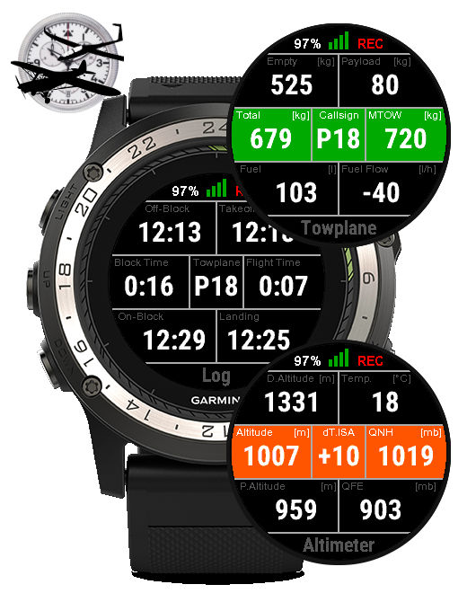

TowplaneSK (Garmin ConnectIQ) App
=================================
The Towplane Swiss Knife for Garmin ConnectIQ devices

   

TowplaneSK - shortname for Towplane Swiss Knife - is a Garmin ConnectIQ
Application that features:
 - a Timer view, tracking your off-block, takeoff, landing and on-block
   time, along elapsed block and flight time
 - a Speed view, displaying your current vertical speed, altitude, ground speed
   and heading, along flight time and optimal tow speed
 - an Altimeter view, showing your current altitude and QNH (using its
   own barometric altimeter), along temperature and density altitude
   as well as pressure altitude (flight level)
 - a Towplane view, showing the current towplane total and maximum
   takeoff weight, along fuel quantity and fuel flow
 - a Glider view, showing the current glider total and maximum
   takeoff weight, along optimal tow speed
 - a Log view, the history of passed flights (timers)

Build, Installation and Usage
-----------------------------

Please refer to the INSTALL and USAGE files.

